# FormForge User Guide

**Version 1.3 · June 2026**

---

## Table of Contents

1. [Introduction](#1-introduction)
2. [Getting Started](#2-getting-started)
3. [Navigation Overview](#3-navigation-overview)
4. [Designer — Building Pages](#4-designer--building-pages)
   - 4.1 [The Designer Library](#41-the-designer-library)
   - 4.2 [Creating a New Designer](#42-creating-a-new-designer)
   - 4.3 [The Canvas Editor](#43-the-canvas-editor)
   - 4.4 [Saving Your Work](#44-saving-your-work)
   - 4.5 [Previewing a Form](#45-previewing-a-form)
   - 4.6 [Publishing a Version](#46-publishing-a-version)
   - 4.7 [Creating a New Version](#47-creating-a-new-version)
   - 4.8 [Archiving a Version](#48-archiving-a-version)
   - 4.9 [Duplicating a Designer](#49-duplicating-a-designer)
   - 4.10 [Version History](#410-version-history)
   - 4.11 [Component Types](#411-component-types)
   - 4.12 [Conditional Visibility and Field Options](#412-conditional-visibility-and-field-options)
   - 4.13 [Dropdown Data Sources](#413-dropdown-data-sources)
   - 4.14 [Dataset Components — Tables and Charts](#414-dataset-components--tables-and-charts)
   - 4.15 [Repeaters](#415-repeaters)
   - 4.16 [Property Inspector — Common Properties](#416-property-inspector--common-properties)
   - 4.17 [Component Properties Reference](#417-component-properties-reference)
   - 4.18 [TreeView Component](#418-treeview-component)
   - 4.19 [Single Record Component](#419-single-record-component)
   - 4.20 [Binding a Dataset to a CRUD Designer Version](#420-binding-a-dataset-to-a-crud-designer-version)
5. [Dataset Manager](#5-dataset-manager)
   - 5.1 [Viewing the Dataset List](#51-viewing-the-dataset-list)
   - 5.2 [Creating a Dataset](#52-creating-a-dataset)
   - 5.3 [Custom Query Mode (SQL)](#53-custom-query-mode-sql)
   - 5.4 [The Visual Query Builder](#54-the-visual-query-builder)
   - 5.5 [Previewing Query Results](#55-previewing-query-results)
   - 5.6 [Saving and Editing a Dataset](#56-saving-and-editing-a-dataset)
   - 5.7 [The Dataset Audit Log](#57-the-dataset-audit-log)
   - 5.8 [Deleting a Dataset](#58-deleting-a-dataset)
   - 5.9 [Who Can Manage Datasets](#59-who-can-manage-datasets)
6. [Menu Management](#6-menu-management)
   - 6.1 [Viewing the Menu List](#61-viewing-the-menu-list)
   - 6.2 [Creating a Menu Item](#62-creating-a-menu-item)
   - 6.3 [Creating a Sub-Menu](#63-creating-a-sub-menu)
   - 6.4 [Reordering Menus](#64-reordering-menus)
   - 6.5 [Binding a Designer to a Menu](#65-binding-a-designer-to-a-menu)
   - 6.6 [Using a Custom Route Path](#66-using-a-custom-route-path)
   - 6.7 [Assigning Roles to a Menu](#67-assigning-roles-to-a-menu)
   - 6.8 [Activating and Deactivating Menus](#68-activating-and-deactivating-menus)
   - 6.9 [Deleting a Menu](#69-deleting-a-menu)
7. [Role and Permission Management](#7-role-and-permission-management)
   - 7.1 [Viewing Roles](#71-viewing-roles)
   - 7.2 [Creating a Custom Role](#72-creating-a-custom-role)
   - 7.3 [Editing Permissions](#73-editing-permissions)
   - 7.4 [System Roles](#74-system-roles)
8. [User Management](#8-user-management)
   - 8.1 [Viewing Users](#81-viewing-users)
   - 8.2 [Creating a User](#82-creating-a-user)
   - 8.3 [Assigning Roles to a User](#83-assigning-roles-to-a-user)
   - 8.4 [Deactivating a User](#84-deactivating-a-user)
   - 8.5 [Resetting a User's MFA](#85-resetting-a-users-mfa)
9. [Working with Data](#9-working-with-data)
   - 9.1 [Accessing a Data Form](#91-accessing-a-data-form)
   - 9.2 [Creating a Record](#92-creating-a-record)
   - 9.3 [Editing a Record](#93-editing-a-record)
   - 9.4 [Deleting and Restoring a Record](#94-deleting-and-restoring-a-record)
   - 9.5 [Sorting and Filtering the Record List](#95-sorting-and-filtering-the-record-list)
   - 9.6 [Exporting Data](#96-exporting-data)
10. [Audit Logs](#10-audit-logs)
11. [Unique Constraints](#11-unique-constraints)
12. [Table Provisioning](#12-table-provisioning)
13. [Account Settings](#13-account-settings)
    - 13.1 [Changing Your Password](#131-changing-your-password)
    - 13.2 [Setting Up Two-Factor Authentication (MFA)](#132-setting-up-two-factor-authentication-mfa)
    - 13.3 [Backup Codes](#133-backup-codes)
    - 13.4 [Re-enrolling or Replacing MFA](#134-re-enrolling-or-replacing-mfa)
14. [Reference](#14-reference)
    - 14.1 [Field Key Naming Rules](#141-field-key-naming-rules)
    - 14.2 [Designer ID Naming Rules](#142-designer-id-naming-rules)
    - 14.3 [Role Name Naming Rules](#143-role-name-naming-rules)
    - 14.4 [Dataset Name Naming Rules](#144-dataset-name-naming-rules)
    - 14.5 [SQL Query Rules (Custom Query Mode)](#145-sql-query-rules-custom-query-mode)
    - 14.6 [Query Builder Filter Operators](#146-query-builder-filter-operators)
    - 14.7 [Provisioning Status Values](#147-provisioning-status-values)
    - 14.8 [Permission Matrix Columns](#148-permission-matrix-columns)
    - 14.9 [Keyboard Shortcuts on the Canvas](#149-keyboard-shortcuts-on-the-canvas)
    - 14.10 [Account Security Quick Reference](#1410-account-security-quick-reference)
    - 14.11 [Component Properties Quick Reference](#1411-component-properties-quick-reference)

---

## 1. Introduction

**FormForge** is a low-code application builder that lets administrators and power-users create data-entry forms, organise them into menus, control who can see and use each form, and work with the resulting data — all without writing database schemas or backend code by hand.

**What FormForge does for you:**

| Capability | Description |
|---|---|
| Visual page builder | Design forms by dragging and dropping components onto a canvas |
| Versioned schemas | Each form design is stored as numbered, independent versions |
| Menu hierarchy | Organise forms into a two-level menu shown in the sidebar |
| Role-based access | Decide which roles can see each menu and what CRUD actions they can perform |
| Automatic database provisioning | Binding a form to a menu creates the backing database table automatically; tables can also be created directly from the Table Provisioning admin page |
| Data integrity | Unique constraints enforce no-duplicate rules at the database level, independently of form validation |
| Custom datasets and reporting | Compose read-only SQL views — by hand or with a visual Query Builder — and surface them as tables and charts |
| Data entry and management | Users access forms through menus; records are listed, edited, restored, and exported |
| Audit logging | Every schema change and data mutation is logged with a before/after diff |
| Account security | Self-service password change, forgotten-password reset by email, and optional two-factor authentication (MFA) |

This guide is written for **platform administrators** who configure the system and **end users** who enter and manage data. Sections that require the `platform-admin` role are marked with **[Admin]**.

---

## 2. Getting Started

### Logging In

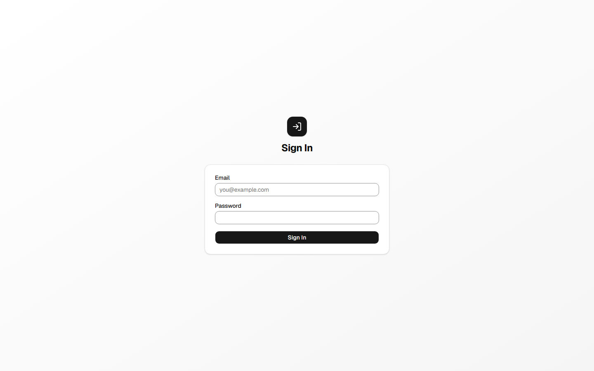

1. Open the FormForge URL provided by your administrator.
2. Enter your **email address** and **password** on the login screen.
3. Click **Sign in**.

When an administrator creates your account, FormForge sends you a **welcome email** containing your email address, a temporary password, and a link to the login page. Sign in with the temporary password, then change it to one of your own from **Account Settings** (see [Section 13.1](#131-changing-your-password)).

> **Session management:** Your session is kept alive automatically for as long as you remain active. If you close the browser and return later, FormForge silently refreshes your session in the background — including when you return to a tab that has been idle or asleep. If the session cannot be restored (e.g. after a long period of inactivity), you are redirected to the login page and returned to where you were after signing in again.

### Two-Factor Authentication at Login

If you have enabled two-factor authentication (MFA) on your account, FormForge prompts you for a second factor **after** your email and password are accepted:

1. Enter your email and password and click **Sign in** as usual.
2. A **Two-factor authentication** screen appears with an **Authentication code** field.
3. Open your authenticator app (e.g. Google Authenticator, Authy), read the current 6-digit code for FormForge, and enter it.
4. Click **Verify**. On success you are signed in and taken to your original destination.

**If you don't have your authenticator app:**

- Click **Use a backup code instead** and enter one of the 8-character backup codes you saved during enrolment. Each backup code works only once.
- Click **Use authenticator code instead** to switch back to the 6-digit code field.

> **Notes:**
> - You have **5 attempts** to enter a correct code. After the 5th wrong attempt the two-factor session ends and you must sign in with your password again.
> - The two-factor session expires after **5 minutes**. If it expires, you'll see *"Session expired. Please sign in again."* — just sign in again to get a fresh prompt.
> - Lost both your authenticator **and** your backup codes? Ask a Platform Admin to reset your MFA (see [Section 8.5](#85-resetting-a-users-mfa)).

See [Section 13.2](#132-setting-up-two-factor-authentication-mfa) for how to turn MFA on.

### Resetting a Forgotten Password

If you can't sign in because you've forgotten your password, you can reset it yourself by email — no administrator involvement is needed.

1. On the login screen, click the **Forgot your password?** link.
2. On the **Forgot Password** page, enter your email address and click **Send Reset Link**.
3. FormForge shows: *"If that email is registered, a reset link has been sent. Check your inbox."* For privacy, this same message appears whether or not the email is registered.
4. Open the email and click the reset link (valid for **1 hour**, single use).
5. On the **Reset Password** page, enter and confirm a new password (at least 8 characters), then click **Reset Password**.
6. You are returned to the login screen with a success message. Sign in with your new password.

> **If the link doesn't work:** Reset links expire after one hour and can be used only once. If you see *"This reset link is invalid or has expired,"* click **Request a new link** to start over. Requesting a new link cancels any earlier unused links.
>
> **Security note:** Resetting your password signs you out of all existing sessions on every device.

### Logging Out

Click your **user chip** (your display name) in the top-right corner of the header, then click **Logout**. Your session is revoked immediately.

---

## 3. Navigation Overview

After logging in you land on the **home page**. The left sidebar is your primary navigation. What you see in the sidebar depends on the menus that have been assigned to your roles.

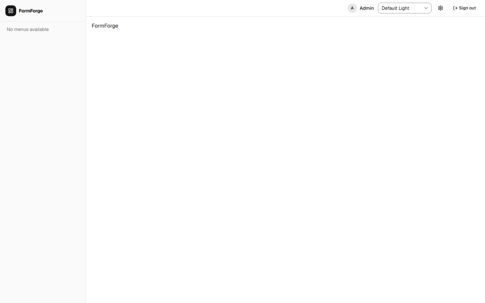

**Fixed sidebar links (always visible to admins):**

| Link | Purpose |
|---|---|
| Designer | Open the Designer Library to build and manage page schemas |
| Admin | Access user, role, menu, dataset, constraints, table provisioning, and audit log management |

**Dynamic sidebar links:**

Menu items created by administrators appear below the fixed links. Top-level menu items can expand to reveal sub-menus. Clicking a menu item that is bound to a designer opens the corresponding data-entry form.

**The Admin area** is organised as a row of tabs across the top of the page:

| Tab | Section |
|---|---|
| Users | [User Management](#8-user-management) |
| Roles | [Role and Permission Management](#7-role-and-permission-management) |
| Menus | [Menu Management](#6-menu-management) |
| Datasets | [Dataset Manager](#5-dataset-manager) |
| Constraints | [Unique Constraints](#11-unique-constraints) |
| Table Provisioning | [Table Provisioning](#12-table-provisioning) |
| Designer | [Designer Library](#41-the-designer-library) |
| Audit Logs | [Audit Logs](#10-audit-logs) |

The **header** contains:
- A **theme toggle** (light / dark / system)
- Your **user chip** with logout

---

## 4. Designer — Building Pages

The Designer is where you build the form layouts that are later bound to menus to create database-backed data-entry screens.

### 4.1 The Designer Library

Navigate to **Designer** in the sidebar. The library shows all form schemas in the system.

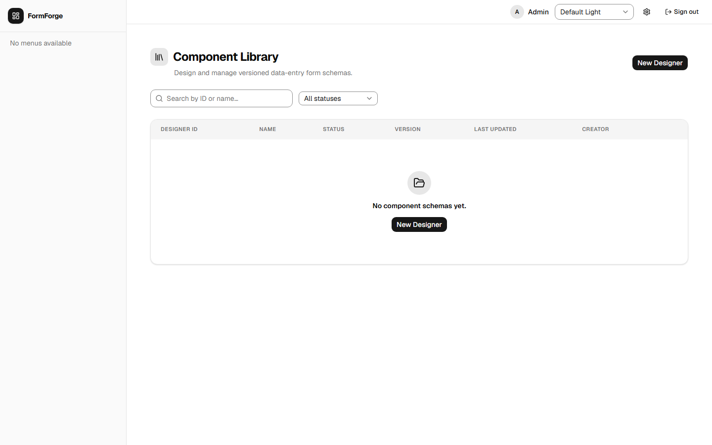

**Available controls:**

| Control | Description |
|---|---|
| Search box | Filter by designer ID or display name |
| Status filter | Show All, Draft, Published, or Archived versions |
| Sort headers | Click any column header to sort; click again to reverse |
| **+ New Designer** button | Open the create dialog |
| Row actions menu (⋯) | Per-row: Open, Preview, Duplicate, Version History |

Each row shows the designer ID, display name, a **mode badge** (CRUD or VIEW — see [Section 4.2](#42-creating-a-new-designer)), the status of the latest version, the latest version number, and the last-updated date.

### 4.2 Creating a New Designer

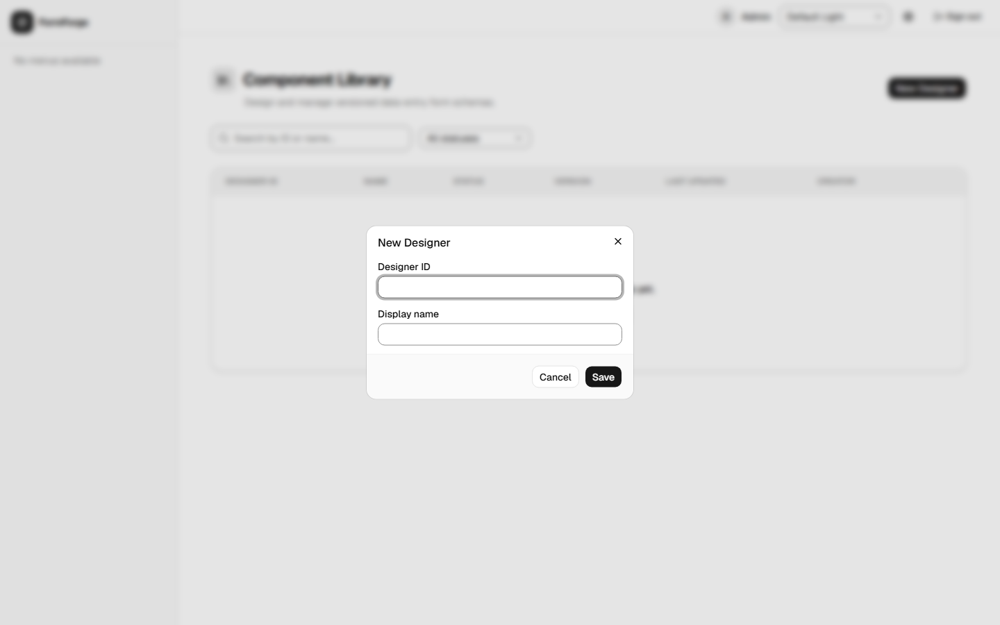

1. Click **+ New Designer** in the library.
2. Fill in the **Designer ID** — a short, permanent identifier for this schema (e.g. `customer_intake`). See [Section 14.2](#142-designer-id-naming-rules) for naming rules.
3. Fill in the **Display Name** — the human-readable title shown on forms and in the library.
4. Choose a **Component mode** (required — there is no default):

   | Mode | Meaning |
   |---|---|
   | **CRUD** | Provisions a database table and supports full data entry (create, read, update, delete). This is the normal choice for data-entry forms. |
   | **VIEW** | Display-only; no table is provisioned and no data entry occurs. Use VIEW designers for dashboards and read-only pages assembled from labels and [Dataset components](#414-dataset-components--tables-and-charts). |

5. Click **Create**.

FormForge creates a new schema with **Version 1** in **Draft** status and opens the canvas editor immediately.

> **Important:** The Designer ID cannot be changed after creation. Choose it carefully.

### 4.3 The Canvas Editor

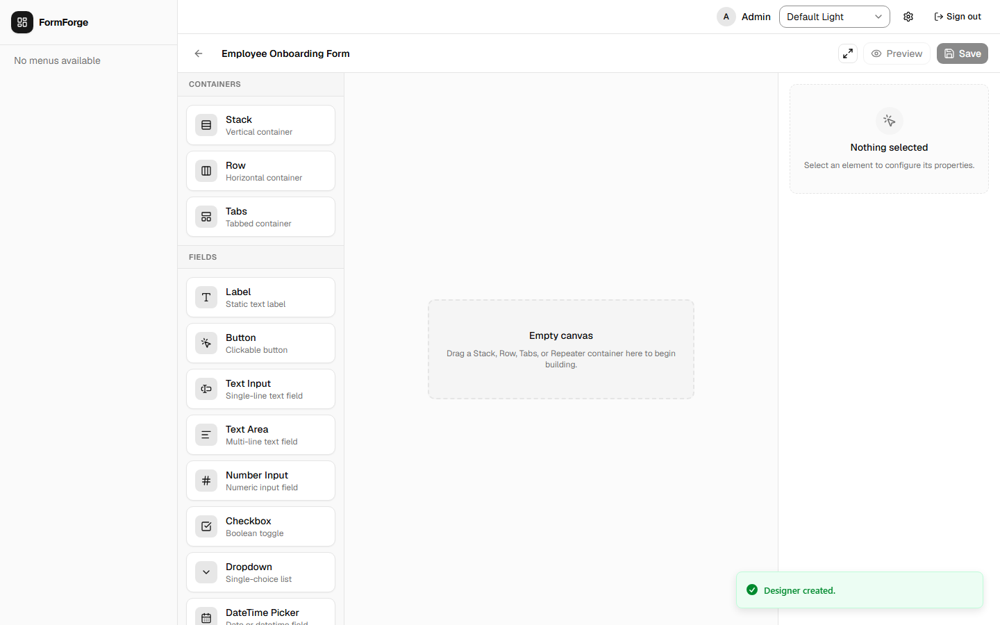

The canvas editor has three panels:

```
┌─────────────┬───────────────────────────┬─────────────────────┐
│  Toolbar    │         Canvas            │  Property Inspector  │
│  (left)     │         (centre)          │  (right)             │
│             │                           │                      │
│  Component  │  Drop components here.    │  Edit the selected   │
│  palette    │  Drag to reorder.         │  component's         │
│             │  Click to select.         │  properties here.    │
└─────────────┴───────────────────────────┴─────────────────────┘
```

**Left toolbar — Component palette:**
Lists all available component types grouped into categories. Drag a component from the palette onto the canvas to add it to the form. See [Section 4.11](#411-component-types) for the full list.

**Centre canvas:**
- **Add a component:** Drag from the palette and drop it at the desired position on the canvas.
- **Reorder a component:** Drag an existing component to a new position.
- **Select a component:** Click it to load its properties in the right panel.
- **Delete a component:** Select it, then press **Delete** or use the remove button in the property inspector.
- **Keyboard drag-and-drop:** Use arrow keys to move focus to a component, press **Space** to "pick it up", navigate with arrows, then press **Space** again to drop.

**Right panel — Property Inspector:**
When a component is selected, you can edit its properties. Every data-capturing component has at minimum:
- **Field Key** — the column name that will be created in the database. Must follow the rules in [Section 14.1](#141-field-key-naming-rules).
- **Label** — the visible label shown to the data-entry user.
- **Required** — whether the field is mandatory.

Additional properties specific to each component type are described in [Section 4.16](#416-property-inspector--common-properties) (common properties shared by most components) and [Section 4.17](#417-component-properties-reference) (properties unique to each component type).

The **form name** is shown at the top of the canvas and is editable inline — click it to rename.

### 4.4 Saving Your Work

Click **Save** in the canvas toolbar. If there are unsaved changes, the Save button shows a badge indicator.

FormForge validates field keys before saving:
- No duplicate field keys within the same schema.
- No PostgreSQL reserved keywords as field keys.

If validation fails, the offending fields are highlighted and a message is shown. Fix the issues before saving.

> **Save behaviour:** Saving overwrites the current version's schema in place. Versions are not immutable snapshots until you explicitly publish them (see below). If you want to preserve the current state before further editing, publish first and then create a new version.

### 4.5 Previewing a Form

Click **Preview** in the canvas toolbar. A modal opens showing the form exactly as it will appear to a data-entry user. Close the modal to return to editing. Preview is available at any time regardless of save or publish status.

### 4.6 Publishing a Version

Publishing marks the current version as ready for use and makes it available to bind to menus.

1. In the canvas editor, click **Publish** in the toolbar.  
   — *or* —  
   In the library, open the row actions menu (⋯) → **Version History** → click **Publish** next to a Draft version.

2. The version status changes from **Draft** to **Published**.

> **Multiple published versions:** You can have more than one published version at a time. Each menu binding specifies which version to use, so publishing a newer version does not automatically update existing menu bindings.

### 4.7 Creating a New Version

When you want to iterate on a published form without affecting live data-entry screens:

1. In the library, open the row actions menu (⋯) → **Version History**.
2. Click **New Version** (or a similar "clone" action beside the version you want to branch from).
3. A new version is created as a **Draft**, pre-populated with the schema from the source version.
4. Click **Open** to edit the new version in the canvas.

### 4.8 Archiving a Version

Archiving removes a version from active circulation without deleting its data.

1. In the library, open the row actions menu → **Version History**.
2. Click **Archive** next to the version you want to archive.

Archived versions cannot be used for new menu bindings but retain their historical data.

### 4.9 Duplicating a Designer

To create a new designer pre-populated with an existing schema:

1. In the library, open the row actions menu (⋯) next to the designer you want to copy.
2. Click **Duplicate**.
3. Provide a new Designer ID and Display Name in the dialog.

The duplicate starts as **Draft Version 1**, containing the same fields as the latest version of the source designer.

### 4.10 Version History

Every designer maintains a full version history.

1. In the library, open the row actions menu (⋯) → **Version History**.
2. A flyout panel opens listing all versions with their status and dates.
3. From here you can: **Preview**, **Open** (edit), **Publish**, or **Archive** individual versions.

### 4.11 Component Types

The palette offers four categories of components.

**Structural containers** (hold and arrange other components):

| Component | Purpose |
|---|---|
| **Stack** | Vertical container — lays children out top-to-bottom |
| **Row** | Horizontal container — lays children out side-by-side |
| **Tabs** | Tabbed container with named, switchable panels |

**Data display** (read-only; connect to external data sources):

| Component | Purpose |
|---|---|
| **Dataset** | Displays rows from a Dataset Manager dataset as a table and/or charts (see [Section 4.14](#414-dataset-components--tables-and-charts)) |
| **Single Record** | Embeds a single-record view from another CRUD designer inline on the page (see [Section 4.19](#419-single-record-component)) |

**Fields** (capture or display data within the form):

| Component | Stores data? | Purpose |
|---|---|---|
| **Label** | No | Static text — headings, instructions, or decorative dividers |
| **Button** | No | Clickable button (no data stored) |
| **Image** | No | Displays an image loaded from a URL |
| **Raw HTML** | No | Renders HTML markup (sanitised before display) |
| **Text Input** | Yes | Single-line text field |
| **Text Area** | Yes | Multi-line text field |
| **Number Input** | Yes | Numeric values (integers or decimals) |
| **Checkbox** | Yes | True/false toggle |
| **Dropdown** | Yes | Single-choice selection from a list (see [Section 4.13](#413-dropdown-data-sources)) |
| **DateTime Picker** | Yes | Date or date-and-time selection |
| **Color Picker** | Yes | Colour selection, stored as a hex code |
| **File** | Yes | File upload |

**Relational components** (model relationships between records):

| Component | Purpose |
|---|---|
| **Repeater** | Captures a one-to-many relationship — multiple rows of sub-data within one parent record (see [Section 4.15](#415-repeaters)) |
| **TreeView** | Captures a self-referencing parent-child hierarchy — an unlimited-depth tree of records (see [Section 4.18](#418-treeview-component)) |
| **Field** | A display-only component that shows a single field value. Can be placed inside a Repeater or TreeView row template, or placed directly on a CRUD form — where it can also surface as a derived column in the record list (see [Section 4.17](#417-component-properties-reference)) |

### 4.12 Conditional Visibility and Field Options

Beyond the basic Field Key / Label / Required settings, the Property Inspector exposes additional options for most components:

| Option | What it does |
|---|---|
| **Conditional visibility** | Hide a component based on other fields. Provide a list of field keys to hide the component when **all** of them are empty, or when **any** of them are empty. Hidden components are excluded both from the layout and from form submission. |
| **Show in table** | Controls whether a field appears as a column in the [record list](#95-sorting-and-filtering-the-record-list). |
| **Column header** | An optional custom column label for the record list. Leave blank to use the field's label. |
| **Column order** | A number that sets the left-to-right position of the column in the record list. |
| **Style class** | An optional custom CSS class for advanced styling. |

### 4.13 Dropdown Data Sources

A **Dropdown** can draw its options from one of several sources, selected in the Property Inspector:

| Source | Description |
|---|---|
| **Static** | A fixed list of label/value pairs you type into the inspector. |
| **Designer** | Pull options from the records of another (CRUD) designer — for example, a list of customers. |
| **Dataset** | Pull options from a [dataset](#5-dataset-manager). Choose the dataset, then specify the **Label field** (the column shown to the user) and the **Value field** (the column stored, typically an ID). |
| **API** | Fetch options from an internal endpoint. |

**Cascading (dependent) dropdowns:** A dropdown can be made to **depend on** one or more other fields. Until those fields have values, the dropdown stays disabled; once they do, the dropdown filters its options based on the selected values (for example, *City* depends on *State*). Dataset-backed dropdowns are searchable and paged, so they work well even with large lists.

### 4.14 Dataset Components — Tables and Charts

The **Dataset** component displays the rows of a [dataset](#5-dataset-manager) directly on a page — ideal for VIEW-mode dashboards.

To configure one:

1. Drag a **Dataset** component onto the canvas and select it.
2. In the Property Inspector, choose the **Dataset** to display.
3. Enable one or more **views**:
   - **Table view** — a paginated, sortable grid of rows.
   - **Bar chart**, **Line chart**, **Pie chart**, **Donut chart** — built with the themed chart palette.
4. For charts, set the **Category column** (the grouping / X-axis) and, where applicable, the **Value column** (the numeric Y-axis), plus an **Aggregation**: `count`, `sum`, `avg`, `min`, or `max`.
5. Optionally mark the component **Filterable** to show filter inputs above the data, and use the **Table columns** dialog to choose which columns appear and to override their headers.

**At runtime**, the data-entry user can switch between the enabled views with the toolbar buttons, filter the data (if enabled), and **export** the visible data to CSV, Excel, or PDF.

> A Dataset component reads through a least-privileged, read-only database role, so it can never modify data — only display it.

### 4.15 Repeaters

A **Repeater** captures a one-to-many relationship — a variable number of rows within a single record (for example, line items on an invoice).

1. Add a **Repeater** to the canvas.
2. In the inspector, point it at a **row-form designer** and **version** — a separate (usually small) designer that defines the fields of each row.
3. To display a value from a row inside the repeater, add a **Field** and choose which row-form field it shows.

At data-entry time, users can add and remove rows; each row collects the fields defined by the row-form designer.

---

### 4.16 Property Inspector — Common Properties

When you click a component on the canvas, the right-hand **Property Inspector** panel shows its configurable properties. Most components share the same foundational set described here. Properties unique to each component type are covered in [Section 4.17](#417-component-properties-reference).

#### Field Key

The most important property on any data-capturing component. The Field Key:

- Becomes the **database column name** when the form is provisioned
- Must be **unique** within the same form
- Must contain only lowercase letters, digits, and underscores (`a–z`, `0–9`, `_`), and must start with a letter or underscore
- Cannot be a PostgreSQL reserved word (such as `select`, `order`, `user`)

Think of it like a column heading in a spreadsheet. Once records exist, changing the Field Key is equivalent to renaming the column — the old column is left as an orphan and a new one is created. **Choose Field Keys carefully before data is entered.**

See [Section 14.1](#141-field-key-naming-rules) for the complete naming rules.

> **Tip:** Use descriptive, underscore-separated names such as `invoice_date`, `customer_email`, or `is_active`. Avoid abbreviations that will be unclear to future administrators.

#### Label

The visible text shown above (or beside) the input on the data-entry form. This has no effect on the database — it is purely for the user's benefit. You can change it at any time without affecting stored data.

#### Required

When turned on, the user must fill in this field before saving a record. Required fields display an asterisk (*) next to their label.

#### Read Only

When turned on, the field is displayed in the form but cannot be edited. Useful for showing auto-generated or system-managed values that should be visible but not changeable.

#### Placeholder

Ghost text that appears inside an empty input, giving the user a hint of what to enter (for example, *"Enter email address"*). It disappears as soon as the user starts typing. Available on text inputs, text areas, and number inputs.

#### Style Classes

A space-separated list of CSS utility classes (Tailwind) for custom visual styling. This is an advanced option intended for administrators with CSS knowledge. Leave it blank in normal use.

#### Conditional Visibility

Lets you hide or show a component based on the values of other fields in the same form. Two modes:

- **Hide when ALL of these fields are empty** — the component stays hidden until every field you list has a value. Use this to reveal a section only after the user has completed an earlier prerequisite.
- **Hide when ANY of these fields is empty** — the component disappears as soon as any one of the listed fields is empty. Use this when a component should only be visible when all its dependencies are filled.

Enter the **Field Keys** of the controlling fields in the list. You can name multiple fields.

> **Important:** Hidden components are fully excluded from form submission. They are not just visually invisible — they do not contribute any data to the saved record. If a value must always be stored regardless of visibility, do not use conditional visibility on that field.

**Example:** You have a *Marital Status* dropdown (field key: `marital_status`) and a *Spouse Name* text input. Set *Spouse Name* to "hide when ANY empty" and list `marital_status`. The spouse name field stays hidden until a marital status is chosen.

#### Show in Table (default: on)

Controls whether this field appears as a column in the record list. Turn it off for fields that are important during entry but would clutter the list — for example, long notes, internal codes, or lengthy descriptions.

#### Column Header

An optional custom label for this field's column in the record list. Leave blank to use the field's Label.

#### Column Order

A number that sets the left-to-right position of this column in the record list. Lower numbers appear further left. Leave blank to use the default order (the order components appear on the canvas).

---

### 4.17 Component Properties Reference

This section describes the properties **unique** to each component type, beyond the common properties covered in [Section 4.16](#416-property-inspector--common-properties). Components that store data are noted; display-only components do not create database columns.

#### Label

Displays static text. No database column is created.

| Property | Description |
|---|---|
| **Text** | The text to display on the form |
| **Font Size** | Size in pixels (default: 14) |
| **Font Weight** | Normal or Bold |

#### Button

A clickable button. No database column is created.

| Property | Description |
|---|---|
| **Label** | Text shown on the button |
| **Variant** | Visual style — **Primary** (brand colour), **Secondary** (neutral), or **Danger** (red) |
| **Disabled** | When on, the button is shown but cannot be clicked |

#### Image

Displays an image loaded from a URL. No database column is created.

| Property | Description |
|---|---|
| **Source URL** | The full URL of the image to display |
| **Alt Text** | Description for screen readers and for when the image fails to load |
| **Width** | Optional fixed display width in pixels |
| **Height** | Optional fixed display height in pixels |

#### Raw HTML

Renders a block of HTML markup on the form. Useful for custom formatting or information blocks that go beyond what a Label can provide. The HTML is sanitised before display — script tags and unsafe attributes are removed. No database column is created.

| Property | Description |
|---|---|
| **HTML content** | The raw HTML to render |

#### Text Input

A single-line text field. Creates a text column in the database.

| Property | Description |
|---|---|
| **Input Type** | Controls the mobile keyboard type and browser-level format hints. Common values: `text` (default), `email`, `url`, `tel`, `password`. Use `email` for built-in email format validation; use `password` to mask the typed value. |
| **Regex Pattern** | An optional validation pattern (HTML5 regular expression). The field's value must match before the record can be saved. Leave blank for no restriction. |
| **Regex Error Message** | The message shown to the user when their input does not match the pattern. |

#### Text Area

A multi-line text field for longer content such as descriptions, notes, or addresses. Creates a text column in the database.

| Property | Description |
|---|---|
| **Rows** | The visible height of the text area in rows (default: 4). Does not limit the amount of text that can be entered — the box scrolls if the content exceeds the visible area. |

#### Number Input

A numeric field. Accepts integers and decimal numbers. Creates a numeric column in the database.

*No component-specific properties beyond the common set.*

#### Checkbox

A true/false toggle. Creates a boolean column in the database.

| Property | Description |
|---|---|
| **Default Checked** | Whether the checkbox starts in the checked (true) state when a new record is created |

> The Checkbox does not support a label-mode toggle — the label always appears inline with the checkbox.

#### Dropdown

Lets the user select one option from a list. Creates a column in the database to store the selected value. For data-source options and cascading behaviour, see [Section 4.13](#413-dropdown-data-sources).

| Property | Description |
|---|---|
| **Options Source** | Where the list of options comes from: **Static**, **Designer**, **Dataset**, or **API** |
| **Options** | *(Static source)* A comma-separated list of option values |
| **Designer** | *(Designer source)* The CRUD designer whose records populate the list |
| **Version** | *(Designer source)* The published version of that designer to use |
| **Dataset** | *(Dataset source)* The dataset whose rows populate the list |
| **Label Field** | *(Designer / Dataset / API)* Which column to show as the option text the user sees |
| **Value Field** | *(Designer / Dataset / API)* Which column's value is stored when the user selects an option |
| **Depends On** | Field Key of another field on the same form. The dropdown stays disabled until that field has a value, then filters its options accordingly — enabling cascading dropdowns (e.g. *City* depends on *State*). |

#### DateTime Picker

A calendar-based selector for dates or date-and-time values. Creates a date or timestamp column in the database.

| Property | Description |
|---|---|
| **Format** | **Date** — stores a calendar date only (year, month, day). **Date & Time** — stores a full timestamp including hours and minutes. |

#### Color Picker

Opens a colour palette for the user to pick a colour. The chosen colour is stored as a hex code (e.g. `#FF5733`). Creates a text column in the database.

| Property | Description |
|---|---|
| **Default Color** | The colour pre-selected when a new record is created (default: black, `#000000`) |

#### File Upload

Lets the user attach a file to a record. The file is stored in object storage and a reference URL is saved in the database column.

| Property | Description |
|---|---|
| **Accepted File Types** | A comma-separated list of MIME types or file extensions the field accepts (e.g. `image/*, .pdf`). Leave blank to allow any file type. |

#### Stack

A vertical container that stacks child components top-to-bottom. Use Stack to group related fields into a visual block or to control vertical spacing.

*No component-specific properties beyond Style Classes.*

#### Row

A horizontal container that places child components side-by-side. Use Row to put two or three fields on the same line.

*No component-specific properties beyond Style Classes.*

#### Tabs

A tabbed container that organises child components into named, switchable panels.

| Property | Description |
|---|---|
| **Orientation** | **Horizontal** — tabs appear across the top. **Vertical** — tabs appear along the left side. |

Each tab panel (child) has its own sub-properties:

| Sub-property | Description |
|---|---|
| **Tab Name** | The label shown on the tab button |
| **Padding** | Space in pixels inside the tab panel content area (default: 8) |
| **Content Gap** | Space in pixels between stacked children inside the panel (default: 8) |

#### Repeater

Captures a one-to-many relationship — multiple rows of sub-data within one parent record. See [Section 4.15](#415-repeaters) for the full walkthrough.

| Property | Description |
|---|---|
| **Row Designer** | The CRUD designer that defines the fields of each row |
| **Row Version** | The published version of the row designer to use |
| **Min Rows** | Minimum number of rows the user must add (blank = no minimum) |
| **Max Rows** | Maximum number of rows the user may add (blank = no limit) |
| **Show Headers** | Whether column headers appear above the row list |

#### Field

A display-only component that shows one field value. It can be placed **inside** a Repeater or TreeView row template (where it reads from the row-form designer's fields), or placed **directly on a CRUD canvas** (where it reads from the canvas's own fields or from the canvas's bound dataset columns).

| Property | Description |
|---|---|
| **Field Name** | The Field Key whose value to display. When inside a Repeater or TreeView, picks from the row-form designer's fields. When placed directly on a CRUD canvas, picks from the canvas's own field keys or — if the canvas has a dataset bound (see [Section 4.20](#420-binding-a-dataset-to-a-crud-designer-version)) — from the dataset's columns. |
| **Map Expression** | An optional JavaScript expression that transforms the raw field value before display (e.g. `value.toUpperCase()` or `value * 1.1`). The expression receives the raw value as `value` and must return the transformed result. Leave blank to display the value as-is. |
| **Is Table Column** | When on, this Field appears as a display-only column in the CRUD record list. The column renders `mapExpression(row[fieldName])` client-side. The Field is hidden from the runtime form while still being visible on the canvas for configuration. Default: off. |
| **Column Header** | An optional custom label for the column in the record list. Leave blank to use the Field Name. Only relevant when **Is Table Column** is on. |
| **Column Order** | A number that sets the left-to-right position of this column in the record list. Only relevant when **Is Table Column** is on. |
| **Inline Style** | Optional CSS declaration string for visual styling of the displayed value |

#### Dataset (data view)

Displays data from a Dataset Manager dataset as a table and/or charts. See [Section 4.14](#414-dataset-components--tables-and-charts) for full configuration details.

| Property | Description |
|---|---|
| **Dataset** | The Dataset Manager dataset to display |
| **Auth Filter Column** | A column name from the dataset. When set, each signed-in user sees only rows where that column matches their own user ID — useful for personalised views. |
| **Filterable** | Shows a filter form above the data so users can narrow results interactively |
| **Table View** | Renders the data as a paginated, sortable grid |
| **Bar / Line / Pie / Donut Chart** | Enables one or more chart visualisations of the data |
| **Category Column** | The column used as the grouping dimension or X-axis in charts |
| **Value Column** | The numeric column that is aggregated for chart height or size |
| **Aggregation** | How to compute the chart metric: **Count**, **Sum**, **Average**, **Min**, or **Max** |

---

### 4.18 TreeView Component

A **TreeView** component captures data that has a natural parent-child structure — for example, a product category hierarchy, an organisational chart, a file-folder tree, or a multi-level location list. Each node can have any number of child nodes, and those children can have children of their own, to any depth.

#### How it works

You define a separate CRUD designer — the *node template* — that describes the fields each tree node holds (for example, Name, Description, Status). The TreeView component takes that template and automatically adds a hidden *parent link*, so every node can point to another node as its parent. The result is a browsable, collapsible tree in the data-entry form.

#### Setting up a TreeView

**Step 1 — Create the node template designer**

1. In the Designer Library, create a new CRUD designer to represent a single tree node. For a product category tree, for example, you might call it `product_category` with fields like `name` and `description`.
2. Publish a version of the node template.

**Step 2 — Add the TreeView to the parent form**

1. Open (or create) the form where the tree will appear.
2. Drag a **TreeView** component from the palette onto the canvas.
3. In the Property Inspector:
   - Set **Row Designer** to the node template (e.g. `product_category`).
   - Set **Row Version** to the published version number.
   - Choose a mode (see below).
4. Save and publish the form.

#### TreeView modes

The TreeView has four mutually exclusive operating modes, chosen by the properties you enable:

| Mode | How to enable | What users can do |
|---|---|---|
| **CRUD** | Enable Can Create, Can Edit, or Can Delete (any combination) | Add child nodes, edit node fields, and delete nodes. The tree is a live data management tool. |
| **Multi-Select** | Enable Is Multi-Select (no CRUD properties) | Check boxes to select multiple nodes. The selected node IDs are stored as a comma-separated list in the Field Key column. Use for recording multiple choices from a tree structure. |
| **Single-Select** | No CRUD, no Is Multi-Select | Radio buttons — one node can be selected at a time. The selected node's ID is stored in the Field Key column. Use for picking one category, one location, etc. |
| **View-Only** | Enable View Mode | Read-only tree browsing — no editing or selection. Use this on dashboards and reports where you want to show a hierarchy without allowing interaction. |

> **Note:** CRUD mode and selection modes are mutually exclusive. If Can Create / Can Edit / Can Delete are enabled, the tree is in CRUD mode and selection is disabled. To use selection, leave all three CRUD properties off.

#### Dataset Source (optional)

By default a TreeView reads its hierarchical data directly from the node template's provisioned table. You can optionally back the tree reads with a **Custom Dataset** instead — for example, to read from a VIEW that pre-joins or pre-filters data. Add/edit/delete operations always write to the base table via the node's `id`, so the dataset VIEW does not need to be updatable.

To enable a dataset source, set the following properties in the Property Inspector:

| Property | Description |
|---|---|
| **Dataset** | The Dataset Manager dataset whose VIEW powers the tree's list, search, and paging queries. Leave blank to use the node template's provisioned table (default). |
| **Key Column** | The dataset column that contains the node's unique identifier. The TreeView maps this column back to `id` internally so expand, select, and CRUD-by-id keep working. Required when a dataset is set. |
| **Parent Column** | The dataset column that holds the self-referencing parent ID. Rows where this column is `NULL` are treated as root nodes. Required when a dataset is set. |

> **Tip:** When a dataset is set, **Field** pickers inside the TreeView's row template list the dataset's columns instead of the node template's field keys — so you can display any column the VIEW exposes.

#### TreeView-specific properties

| Property | Description |
|---|---|
| **Row Designer** | The CRUD designer that defines the fields of each tree node |
| **Row Version** | The published version of the node designer to use |
| **Dataset** | *(Optional)* A Dataset Manager dataset that powers tree reads. See Dataset Source above. |
| **Key Column** | *(Dataset source)* The dataset column that maps to the node's unique ID |
| **Parent Column** | *(Dataset source)* The dataset column that holds the parent self-reference |
| **Can Create** | Show an Add button so users can create new root and child nodes |
| **Can Edit** | Show an Edit button per node so users can update node fields |
| **Can Delete** | Show a Delete button per node. Deleting a node also deletes all of its descendants (cascade delete). |
| **Is Multi-Select** | Show checkboxes for selecting multiple nodes simultaneously |
| **Select All** | *(Multi-Select mode)* Checking a parent node automatically checks its entire subtree |
| **View Mode** | Make the tree fully read-only, overriding all CRUD and selection properties |
| **Page Size** | How many nodes to load at each level at a time (default: 25). Increase for wide trees; decrease for large or deep trees to keep load times fast. |
| **Auth Filter Column** | A column name from the node template (or dataset). When set, each signed-in user sees only the nodes where that column matches their own user ID — useful for personal task trees or user-scoped category lists. |

#### At runtime

- Tree levels are loaded on demand as the user expands nodes (lazy loading keeps the page fast).
- A **search bar** appears at each level so users can filter nodes by name without expanding the whole tree.
- In **CRUD mode**: an **Add root node** button appears at the top of the tree; each expanded parent shows an **Add child** button. Clicking either opens the row-form drawer pre-filled with the node template fields.
- Editing a node opens the row-form drawer. Saving it updates that node's fields.
- **Cascade delete:** Deleting a parent node automatically soft-deletes all descendant nodes. Deleted nodes can be restored from the record list using the **Show deleted** toggle.
- In **Multi-Select** mode: the selected IDs are stored as a comma-separated string in the Field Key column of the parent record.

#### Canvas preview vs. runtime

On the design canvas, the TreeView shows a static placeholder with two sample nodes and their expand/collapse icons. The actual tree data is only loaded at runtime in the data-entry form.

---

### 4.19 Single Record Component

The **Single Record** component embeds a complete data-entry form from another CRUD designer directly inside the current form. Instead of navigating away to a separate page, the user fills in the embedded designer's fields inline.

**When to use it:**
- A *contact details* section that is managed in a separate designer but should appear as part of a larger form.
- A reusable *address* designer embedded in multiple parent forms.
- An *approval* form linked inline within a request form.

**Configuration:**
1. Drag **Single Record** onto the canvas.
2. In the Property Inspector:
   - Set **Designer** to the target CRUD designer.
   - Set **Version** to the published version to embed.
3. Save.

The embedded form displays all fields from the target designer and allows the user to create or edit exactly one record from that designer, from within the parent page.

---

### 4.20 Binding a Dataset to a CRUD Designer Version

By default, a CRUD designer's record list reads rows from its own provisioned database table. You can optionally bind a **Custom Dataset** to a specific version so that the list (and its export) reads from the dataset's backing VIEW instead — useful when the VIEW applies joins, computed columns, or business-logic filters that you want to expose in the list without changing the underlying table schema. Create, edit, and delete operations always write to the base table by `id`, so the VIEW does not need to be updatable.

**Convention:** The dataset VIEW must expose one column per field key in the designer plus the record ID as `<designerID>_id` (e.g. `customer_id`). FormForge maps that column back to `id` automatically for update and delete operations.

**How to bind a dataset to a version:**

1. In the **Designer Library**, locate the CRUD designer you want to configure.
2. In the row's actions menu (⋯), choose **Version History**.
3. Next to the version you want to configure, click **Dataset**. The Dataset dialog opens.
4. Select a dataset from the dropdown (all datasets in the system are listed).
5. Click **Save**. From this point on, the record list for any menu binding that uses this version will read from the dataset VIEW.

To remove the binding, reopen the Dataset dialog and clear the selection, then save.

> **Effect on Field components:** When a CRUD canvas version has a dataset bound, **Field** components placed directly on that canvas will offer the dataset's columns in their **Field Name** picker — in addition to the canvas's own field keys.

> **Note:** The dataset binding is per version. Different versions of the same designer can bind to different datasets (or none).

---

## 5. Dataset Manager

**[Admin]** The Dataset Manager is found under **Admin → Datasets**.

> **What is a dataset?**
>
> A dataset is a saved, named, read-only query that you define once and reuse in many places. Think of it as a named window into your data — it runs a `SELECT` query and presents the results. Datasets are completely separate from CRUD designers: a designer is where you *enter* data; a dataset is how you *view and analyse* it.
>
> Datasets can power:
> - **Tables and charts** on VIEW-mode dashboard pages (via the [Dataset component](#414-dataset-components--tables-and-charts))
> - **Dropdown options** that show records from the database (see [Section 4.13](#413-dropdown-data-sources))
> - **Reports** that users can export to CSV, Excel, or PDF
>
> A dataset **never stores data of its own** and **never modifies data**. It only reads. It runs under a least-privileged, read-only database role, so it is safe to expose to end users.

Every dataset is authored in one of two modes:

| Mode | Description |
|---|---|
| **Custom Query** | You write the `SELECT` statement yourself in a SQL editor. |
| **Query Builder** | You compose the query visually — drag tables onto a canvas, pick columns, draw joins, add filters and ordering — without writing SQL. |

### 5.1 Viewing the Dataset List

The Dataset Manager opens on a paginated list titled **Dataset Manager** ("Create and manage custom datasets for reporting").

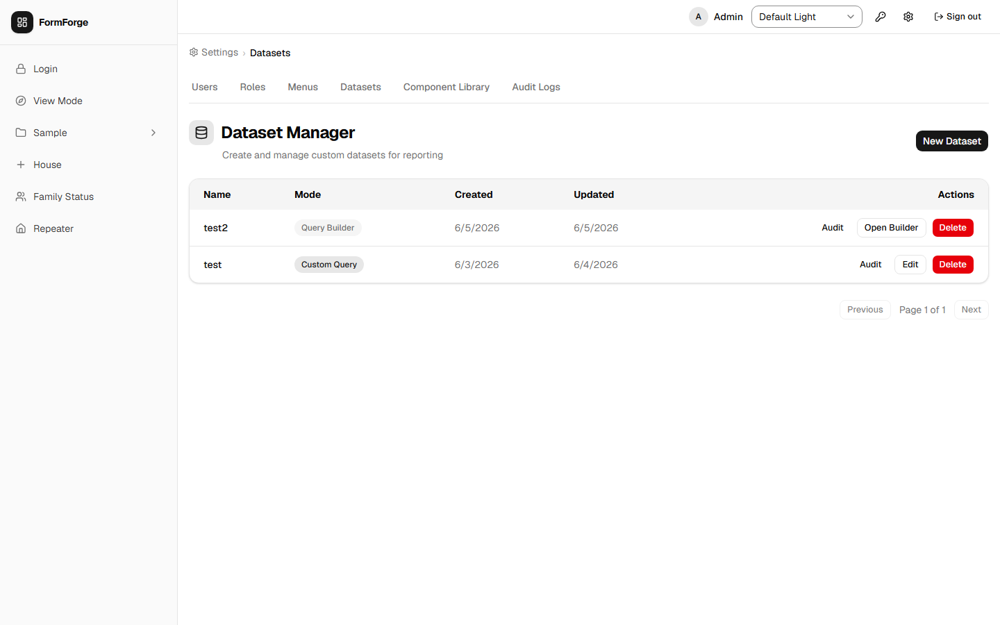

**Columns:** Name, Mode (a *Custom Query* or *Query Builder* badge), Created, Updated, and Actions.

**Row actions:**

| Action | Available for | Description |
|---|---|---|
| **Audit** | All datasets | Toggle an inline [audit log](#57-the-dataset-audit-log) for that dataset |
| **Edit** | Custom Query datasets | Open the inline edit form to change the SQL |
| **Open Builder** | Query Builder datasets | Open the full-screen [visual Query Builder](#54-the-visual-query-builder) |
| **Delete** | All datasets | Permanently delete the dataset and drop its database view |

If there are no datasets yet, the list shows *"No datasets yet"* with a prompt to *"Create your first dataset to get started."*

### 5.2 Creating a Dataset

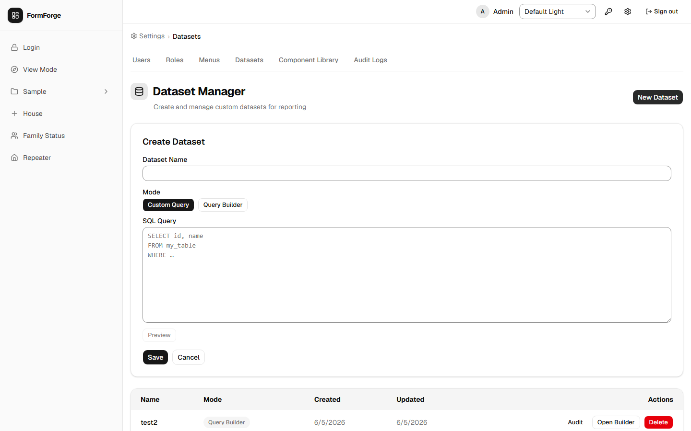

1. Click **New Dataset**.
2. Fill in the **Dataset Name** — see [Section 14.4](#144-dataset-name-naming-rules) for the rules (lowercase letters, digits, and underscores; must start with a letter or underscore; up to 63 characters; cannot be a reserved name).
3. Choose the **Mode** — **Custom Query** or **Query Builder**.
4. Then:
   - **Custom Query:** type your `SELECT` statement in the SQL editor (see [Section 5.3](#53-custom-query-mode-sql)) and click **Save**.
   - **Query Builder:** click **Save** to create the empty dataset first. FormForge reminds you: *"Save the dataset first, then open it to build your query in the visual Query Builder."* Then use **Open Builder** from the list to compose the query (see [Section 5.4](#54-the-visual-query-builder)).

Switching between modes while editing preserves any SQL you have typed. On success you'll see a *"Dataset created."* confirmation.

> If you choose a name that is already taken, FormForge shows *"A dataset with this name already exists."*

### 5.3 Custom Query Mode (SQL)

In Custom Query mode you write the query directly in a SQL editor (placeholder: `SELECT id, name FROM my_table WHERE …`).

FormForge enforces that the query is **a single, read-only `SELECT`**:

- Only one statement is allowed.
- `INSERT`, `UPDATE`, `DELETE`, `SELECT INTO`, and data-modifying CTEs are rejected.
- Every table and column you reference must exist.

If the query violates these rules you'll see the server's explanation, or the fallback message: *"The query could not be applied. It must be a single read-only SELECT, and every referenced table and column must exist."* See [Section 14.5](#145-sql-query-rules-custom-query-mode) for the full rule set.

### 5.4 The Visual Query Builder

Query Builder datasets open in a full-screen canvas. Use the **fullscreen** toggle, **Preview**, and **Save** buttons in the top bar.

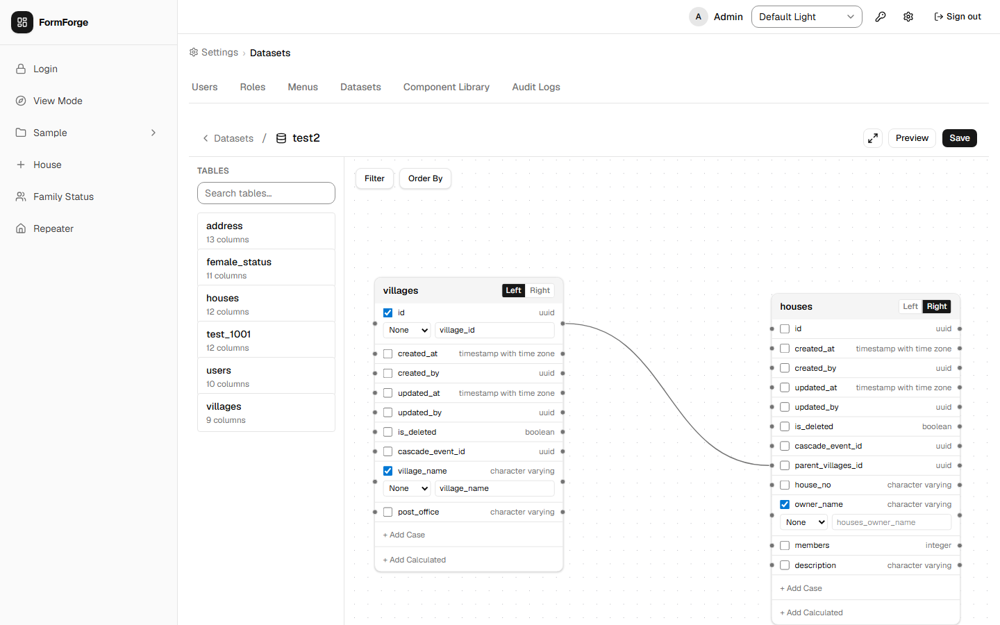

#### Step-by-step walkthrough

The following example builds a dataset that joins a `customer` table to an `order` table and shows only active orders. Replace the table and column names with your own.

1. **Open the builder.** From the Dataset list, click **Open Builder** on a Query Builder dataset (or create a new one in Query Builder mode, save it, then open it).

2. **Add tables.** The **Table palette** on the left lists all tables available to query. Drag **customer** onto the canvas — a card appears showing all its columns. Drag **order** onto the canvas as well.

3. **Mark the Left table.** Every query must have exactly one *Left* (FROM) table. Click the star or *Left* toggle on the **customer** card to designate it. The card border highlights to confirm.

4. **Select columns.** Within each card, tick the columns to include in the results. Tick `id` and `name` on **customer**; tick `id`, `total`, `status`, and `created_at` on **order**.

   For any ticked column you can optionally set:
   - An **alias** — a custom output name shown to end users (e.g. rename `id` to `order_id`).
   - An **aggregate** — `COUNT`, `SUM`, `AVG`, `MIN`, or `MAX` (applied per row group).

5. **Draw a join.** Hover over the `id` column on the **customer** card until a small connection dot appears, then drag it to the `customer_id` column on the **order** card. A join line appears. Click the line to open the **join inspector** and choose the join type:

   | Join type | What it returns |
   |---|---|
   | **INNER** | Only rows where both sides match |
   | **LEFT** | All rows from the Left table; nulls where the Right table has no match |
   | **RIGHT** | All rows from the Right table; nulls where the Left table has no match |
   | **FULL OUTER** | All rows from both tables; nulls wherever a match is missing |

6. **Add a filter.** Click **Filter** in the toolbar to open the **Filter Conditions** dialog. Click **Add condition** and set: Table = `order`, Column = `status`, Operator = `=`, Value = `active`. See [Section 14.6](#146-query-builder-filter-operators) for all available operators. Combine multiple conditions with **AND** / **OR** and nest groups for parentheses.

7. **Add sorting.** Click **Order By** and add a sort clause: Table = `order`, Column = `created_at`, Direction = **DESC**. Multiple sort clauses are evaluated in order.

8. **Add a CASE column (optional).** Click **+ Add Case** on a table card to build a conditional column — one or more **WHEN … THEN** branches and an optional **ELSE** value. Every CASE column requires an alias.

9. **Add a calculated column (optional).** Click **+ Add Calculated** to add a column derived from an expression, for example `price * quantity`. Every calculated column requires an alias; the expression is validated when you save.

10. **Preview.** Click **Preview** to run the query and inspect a sample of the results before saving (see [Section 5.5](#55-previewing-query-results)).

11. **Save.** Click **Save**. FormForge validates the query (Left table designated, at least one column selected, all CASE/calculated columns have aliases) and creates or updates the backing database view.

#### Validation rules

Before you can save, the builder checks:
- A Left (FROM) table has been designated.
- At least one column is selected.
- Every CASE column and every calculated column has an alias.

Any unmet rule is shown as a banner and the **Save** button stays disabled until resolved.

### 5.5 Previewing Query Results

In either mode, click **Preview** to run the query and see a sample of the results in the **Query Preview** dialog. The preview is capped (the footer reads *"… row(s) shown (LIMIT 10)"*) and runs under a time limit. If the query is too slow you'll see *"Preview query exceeded the time limit. Simplify the query or add filters."*

### 5.6 Saving and Editing a Dataset

Saving a dataset creates (or updates) its backing database **view**. You'll see *"Dataset saved."* on success.

To change a dataset later, use **Edit** (Custom Query) or **Open Builder** (Query Builder) from the list. If someone else changed the dataset since you opened it, FormForge warns: *"This dataset was modified by someone else. Reload to see the latest version."*

### 5.7 The Dataset Audit Log

Click **Audit** on any dataset row to expand its audit trail. Each entry records the **Timestamp**, **Dataset**, **Operation**, **Actor**, and **Status** (*Success* or *Failed (rolled back)*). The log is paginated and read-only.

### 5.8 Deleting a Dataset

Click **Delete** on a dataset row and confirm. Deleting a dataset **permanently drops the associated database view**.

> Deleting a dataset that is still referenced by a Dataset component or a dataset-backed dropdown will leave those components without data. Re-point or remove them first.

### 5.9 Who Can Manage Datasets

Opening the **Admin → Datasets** page requires the `platform-admin` role. Creating, editing, and deleting datasets additionally requires the **Dataset Management** capability on one of your roles (see [Section 7.3](#73-editing-permissions)). Running, displaying, and exporting dataset data through components and dropdowns is available to any signed-in user who can see the page that contains them.

---

## 6. Menu Management

**[Admin]** Menu management is found under **Admin → Menus**.

Menus organise form links in the sidebar. FormForge supports a two-level hierarchy: **top-level menus** and **sub-menus** (children of a top-level menu). Sub-menus cannot have further children.

### 6.1 Viewing the Menu List

The menu list shows all menus with their name, parent (if any), active status, icon, and assigned-role count.

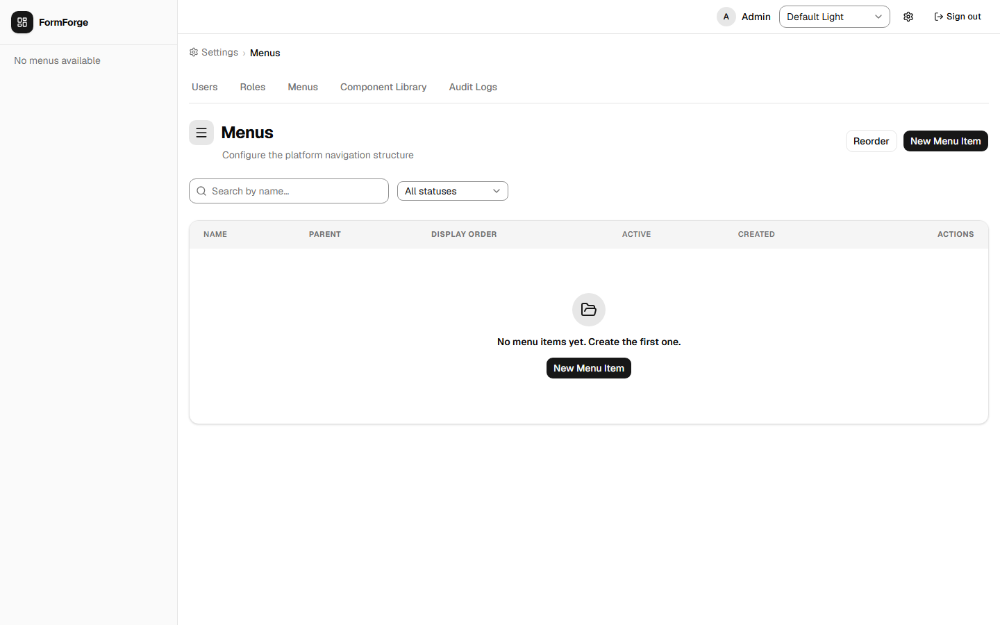

**Available controls:**

| Control | Description |
|---|---|
| Search box | Filter by name |
| Active/Inactive toggle | Show all, active only, or inactive only |
| **+ New Menu** button | Open the create dialog |
| **Reorder Mode** button | Enable drag-and-drop reordering |
| Row actions (⋯) | Open detail, toggle active, delete |

### 6.2 Creating a Menu Item

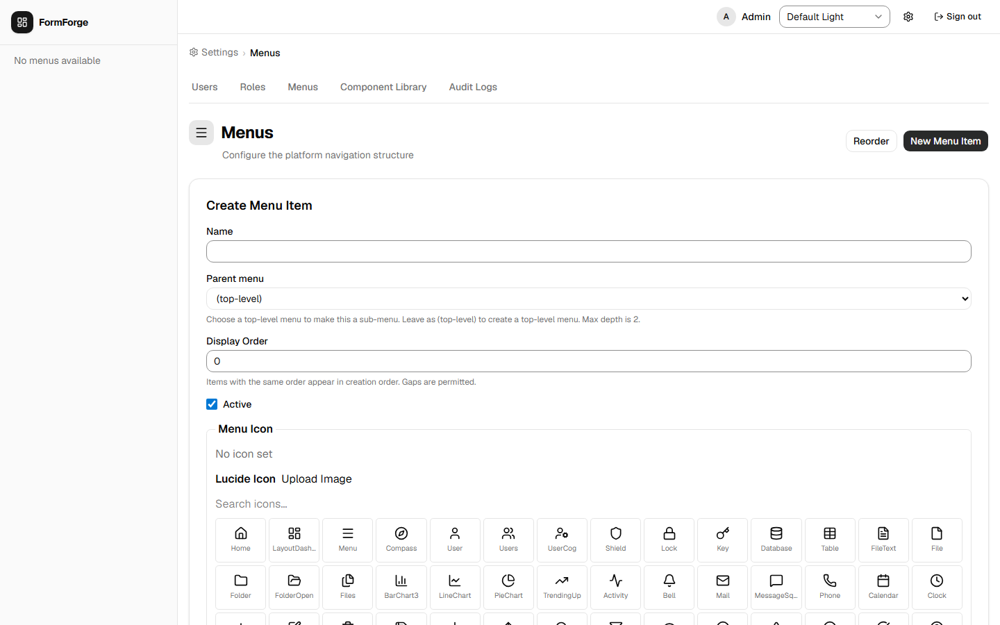

1. Click **+ New Menu**.
2. Fill in the fields:

| Field | Description |
|---|---|
| **Name** | The label shown in the sidebar |
| **Parent** | Leave blank for a top-level menu; select an existing top-level menu to create a sub-menu |
| **Order** | Numeric position within its level |
| **Icon** | Select an icon from the icon picker |
| **Active** | Whether the menu is immediately visible to users |

3. Click **Create**.

> A menu item with a parent cannot itself be a parent — the system enforces a maximum depth of two levels.

### 6.3 Creating a Sub-Menu

Sub-menus can also be created from within a top-level menu's detail page:

1. Click a top-level menu row to open its detail page.
2. Scroll to the **Sub-Menus** section.
3. Click **Add Sub-Menu** and fill in the name, order, icon, and active status.
4. Click **Save**.

### 6.4 Reordering Menus

1. Click **Reorder Mode** on the menu list page.
2. Drag menu rows into the desired order using the handle on the left.
3. Keyboard users: focus a row, press **Space** to pick it up, use **↑/↓** to move it, press **Space** again to drop.
4. Click **Save Order** to persist the new order.

### 6.5 Binding a Designer to a Menu

Binding connects a menu item to a form schema and causes FormForge to create the backing database table automatically.

1. Open the menu detail page.
2. Scroll to the **Designer Binding** section.
3. Select a **Designer** from the dropdown (lists all designers with at least one published version).
4. Select the **Version** to use.
5. Click **Save Binding**.

**What happens next:**

| Step | Status shown |
|---|---|
| Binding saved | **Pending** |
| Database table created successfully | **Success** |
| Table creation failed | **Error** (reason shown) |

The status updates automatically — refresh the page if needed. Once status is **Success**, the menu item routes users to the data-entry form. See [Section 14.7](#147-provisioning-status-values) for details on each status value.

> **VIEW-mode designers:** A VIEW-mode designer (see [Section 4.2](#42-creating-a-new-designer)) does not provision a table, so its binding shows as *not applicable* rather than a provisioning status — it simply renders the read-only page.

> **Changing a binding:** To switch to a different designer or version, repeat the steps above. Existing records in the old table are not migrated automatically.

> **Mutually exclusive:** A menu item can have either a Designer Binding *or* a Custom Route Path — not both. Setting one clears the other.

### 6.6 Using a Custom Route Path

Instead of binding a designer, you can point a menu item to an arbitrary internal route:

1. Open the menu detail page.
2. In the **Designer Binding** section, choose the **Custom Route** tab.
3. Enter the route path (e.g. `/reports/monthly`).
4. Click **Save**.

### 6.7 Assigning Roles to a Menu

Only users who hold at least one of the assigned roles will see the menu item in the sidebar.

1. Open the menu detail page.
2. Scroll to the **Role Assignments** section.
3. Check the boxes next to the roles that should have access.
4. Click **Save Assignments**.

> **Removing all roles:** Clearing every checkbox hides the menu from all users. A 3-second confirmation timer appears before the save is processed, giving you a chance to cancel.

### 6.8 Activating and Deactivating Menus

A deactivated menu is hidden from all users regardless of role assignments.

- From the menu list: click the row actions menu (⋯) → **Deactivate** / **Activate**.
- From the menu detail page: toggle the **Active** switch and save.

### 6.9 Deleting a Menu

1. Click the row actions menu (⋯) → **Delete**.
2. Confirm the deletion in the dialog.

> **Important:** You cannot delete a top-level menu that still has sub-menus. Delete or re-parent the children first.

---

## 7. Role and Permission Management

**[Admin]** Role management is found under **Admin → Roles**.

Roles control what actions users can perform. Each role holds a matrix of permissions, one row per form (designer), specifying which CRUD operations and exports the role allows.

### 7.1 Viewing Roles

The roles list shows all roles with their name, description, type (System or Custom), and creation date.

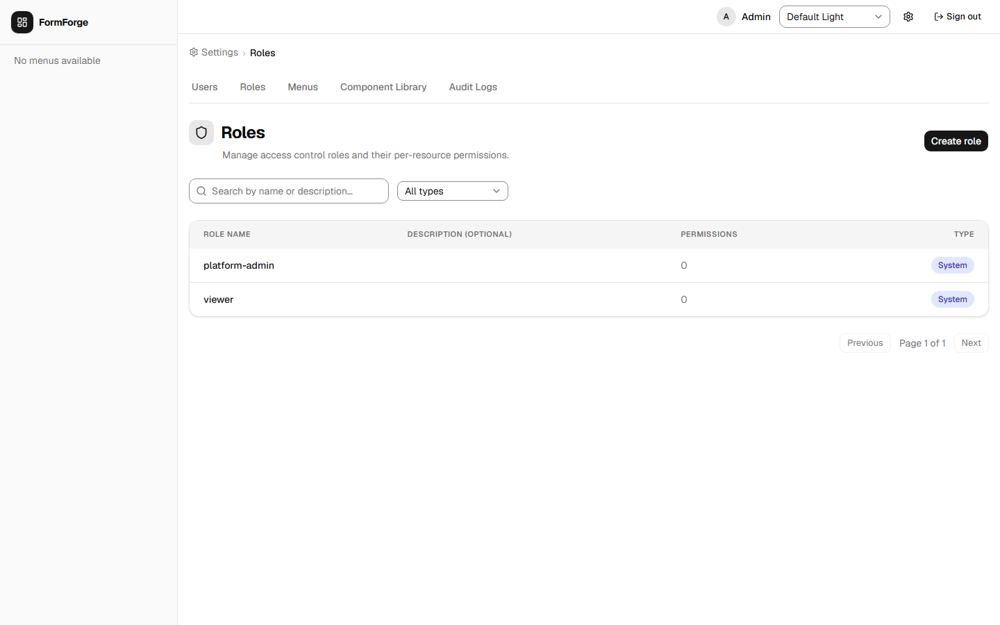

**Available controls:**

| Control | Description |
|---|---|
| Search box | Filter by name |
| Type filter | Show All, System, or Custom |
| **+ New Role** button | Open the create dialog |

### 7.2 Creating a Custom Role

1. Click **+ New Role**.
2. Fill in the fields:

| Field | Rule |
|---|---|
| **Name** | Lowercase letters, digits, and hyphens only; 1–100 characters (e.g. `data-entry-staff`) |
| **Description** | Optional free text |

3. Click **Create**. The new role has no permissions by default.
4. You are taken to the role detail page where you can configure the permission matrix.

### 7.3 Editing Permissions

On the **role detail page**, the permission matrix lists one row for every designer in the system plus any system-level resources.

**Matrix columns:**

| Column | Allows |
|---|---|
| Can Create | Add new records |
| Can Read | View existing records |
| Can Update | Edit existing records |
| Can Delete | Delete records |
| Can Export | Export records to CSV/Excel/PDF |

In addition to the per-designer matrix, the role detail page has a **Dataset Management** toggle: *"Allow this role to create, edit, and delete Datasets."* Turn this on to let members of the role manage datasets in the [Dataset Manager](#5-dataset-manager).

To edit:
1. Check or uncheck the boxes in each row, and set the Dataset Management toggle as needed.
2. You may also edit the role **Name** and **Description** on this page.
3. Click **Save** — name, description, the Dataset Management capability, and the entire permission matrix are saved atomically.

### 7.4 System Roles

FormForge ships with two built-in system roles that cannot be modified or deleted:

| Role | Description |
|---|---|
| `platform-admin` | Full access to all features including the Admin section |
| `viewer` | Read-only access to all records |

---

## 8. User Management

**[Admin]** User management is found under **Admin → Users**.

### 8.1 Viewing Users

The user list shows all user accounts with their display name, email, active status, and number of assigned roles.

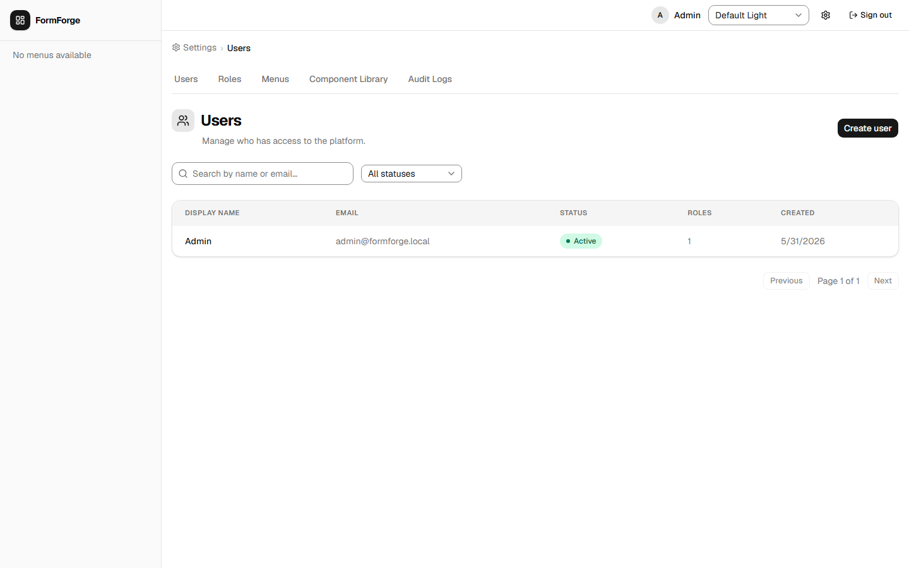

**Available controls:**

| Control | Description |
|---|---|
| Search box | Filter by name or email |
| Status filter | Active only, Inactive only, or All |
| Sort headers | Click any column header to sort |
| **+ New User** button | Open the create dialog |

### 8.2 Creating a User

1. Click **+ New User**.
2. Fill in the fields:

| Field | Description |
|---|---|
| **Email** | The user's login email address |
| **Display Name** | Full name shown in the UI |
| **Temporary Password** | At least 8 characters; share this with the user out-of-band |

3. Click **Create**. The user is active immediately and can log in with the temporary password.

### 8.3 Assigning Roles to a User

1. Click a user row to open the user detail page.
2. In the **Roles** section, check the boxes for the roles you want to assign.
3. Click **Save**.

A user may hold multiple roles. Their effective permissions are the union of all permissions across their assigned roles.

### 8.4 Deactivating a User

Deactivating a user prevents them from logging in and invalidates any active sessions.

1. From the user list: click the row actions menu (⋯) → **Deactivate**.  
   — *or* —  
   From the user detail page: toggle the **Active** switch and save.

To re-enable the account, follow the same steps and choose **Activate**.

### 8.5 Resetting a User's MFA

**[Admin]** If a user has lost both their authenticator device **and** their backup codes, they cannot complete the two-factor prompt and are locked out. A Platform Admin can clear their MFA so they can sign in with just their password and re-enrol.

1. Open **Admin → Users** and click the user's row to open their detail page.
2. If the user has MFA enabled, a **Reset MFA** button is shown.
3. Click **Reset MFA**. A confirmation dialog appears explaining that this will *disable two-factor authentication, revoke all active sessions, and delete all backup codes* for the user.
4. Click **Yes, reset MFA** to confirm.

On success the page refreshes to show MFA as no longer enabled, and the user is signed out of all sessions.

> **What the user sees next:** Their next login proceeds straight to the application after the password step — no two-factor prompt. They can re-enable MFA at any time from their own Account Settings (see [Section 13.2](#132-setting-up-two-factor-authentication-mfa)).
>
> This action is idempotent — running it against an account that has no MFA enabled simply succeeds with no effect.

---

## 9. Working with Data

Once a menu item is bound to a published designer and its provisioning status is **Success**, users with the appropriate permissions can create and manage records through the menu.

### 9.1 Accessing a Data Form

Click the menu item in the sidebar. FormForge opens the **record list** for that form. The columns shown correspond to the fields defined in the bound designer (and to each field's *Show in table* setting — see [Section 4.12](#412-conditional-visibility-and-field-options)).

### 9.2 Creating a Record

1. Click **+ New Record** on the record list page.
2. Fill in the fields on the data-entry form. Required fields are marked with an asterisk.
3. Click **Save**. The record is saved to the database and you are taken to the record detail page.

### 9.3 Editing a Record

1. Click any row in the record list to open the record detail page.
2. Edit the fields as needed.
3. Click **Save**.

### 9.4 Deleting and Restoring a Record

1. Open the record detail page.
2. Click **Delete** and confirm the action.

Deleted records are **soft-deleted** — they remain in the database but are hidden from normal list views.

**To see and restore deleted records (admin):**
- Turn on the **Show deleted** toggle on the record list. Deleted rows appear with a **Deleted** badge.
- Click **Restore** on a deleted row to bring it back. On success you'll see *"Record restored."*

### 9.5 Sorting and Filtering the Record List

**Sorting:**
- Click a column header to sort by that column (ascending).
- Click again to reverse the order.
- Hold **Shift** and click additional column headers to add secondary, tertiary, etc. sort levels.

**Filtering:**
- A filter row appears below the column headers.
- Type in any filter cell to narrow rows for that column.
- Multiple column filters are applied simultaneously (AND logic).

**Pagination:**
- Use the pagination controls at the bottom of the list.
- Change the page size to show more or fewer rows per page.

### 9.6 Exporting Data

Click **Export** on the record list page and choose **CSV**, **Excel**, or **PDF**. The export respects any active filters and sorting, so you can export a subset of data by filtering first.

> The Export option is only visible if your role has **Can Export** permission for that designer.

---

## 10. Audit Logs

**[Admin]** Audit logs are found under **Admin → Audit**.

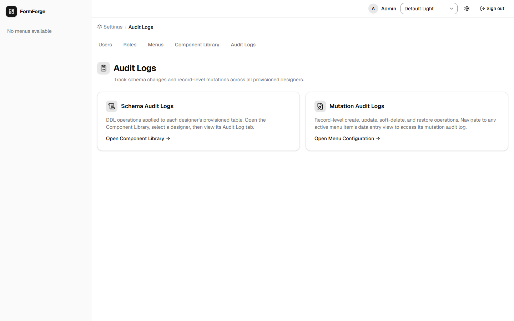

FormForge maintains several audit trails:

| Log type | What it records |
|---|---|
| **Schema audit log** | Every change to a form schema (fields added, removed, or renamed) |
| **Data mutation log** | Every create, update, soft-delete, and restore on a data record, with before/after field values |
| **Dataset audit log** | Every create, edit, and delete of a [dataset](#57-the-dataset-audit-log), with success/rollback status |

The main audit log page supports date-range filtering, resource filtering, and user filtering. Entries are read-only and cannot be deleted.

**Per-designer views (admin).** In addition to the consolidated log, administrators can open focused, per-designer views:

- **Schema Audit Log** — every DDL operation applied to one designer's provisioned table, newest first.
- **Mutation Audit Log** — every record-level mutation on one designer's table. Reach it from the data-entry view of the relevant menu item.
- **Schema Drift** — surfaces *orphaned columns* that exist in the database but are no longer in the current Designer schema, and lets an admin drop them.

---

## 11. Unique Constraints

**[Admin]** Navigate to **Admin → Constraints**.

A unique constraint is a rule enforced directly by the database: it prevents two records from having the same value (or the same combination of values) in specified columns.

### Why use database constraints?

Form validation catches duplicates during normal data entry, but it has a gap: if two users submit identical records at exactly the same moment, or if data is loaded directly into the database, form validation can be bypassed. A database-level unique constraint is enforced unconditionally by the database engine — a duplicate is physically impossible to store, regardless of how the data arrives.

**When would you use this?**
- An `email` column on a `customer` designer — no two customers should share an email address.
- A `code` column on a `product` designer — every product code must be unique.
- A composite constraint on `first_name` + `last_name` + `date_of_birth` — the same person should not appear twice.

### The Constraints page


The page opens with a **Designer** searchable dropdown. Only CRUD designers whose database tables already exist (provisioned designers) appear. Each option shows the designer's display name and, if it is bound to menus, the menu names alongside — for example, *"Customer · Customers, Main Menu > Customers"*.

After selecting a designer, two cards appear:

| Card | What it shows |
|---|---|
| **Add Constraint** | Every user-authored column in the table, shown as checkboxes. System columns (`id`, `created_at`, parent foreign-key columns) are excluded. Each column also shows its PostgreSQL data type. |
| **Existing Constraints** | A table of constraints already defined for this designer, showing each constraint's internal name and the column or columns it covers. |

### Adding a unique constraint

1. Go to **Admin → Constraints**.
2. Select the designer you want to constrain from the dropdown.
3. In the **Add Constraint** card, check the column(s) to include:
   - **One column checked** — values in that column must be globally unique across all records. No two records may store the same value.
   - **Two or more columns checked** — the *combination* of those column values must be unique. Individual columns may repeat across records, but the exact same combination may not. For example, checking `first_name` and `last_name` means *"John Smith"* can appear only once, even though many records can have the first name *"John"*.
4. Click **Add Constraint**.

The constraint is applied to the live database immediately. From that moment on, any attempt to save a record that would violate the rule is rejected with an error message.

### Removing a constraint

In the **Existing Constraints** card, find the constraint you want to remove and click **Drop**. A confirmation dialog shows the constraint name and which columns it covers. Click **Confirm Drop** to proceed.

The constraint is removed from the database immediately. Duplicate values are permitted again from that moment on.

> **Note:** Removing a constraint does not remove or alter any existing records. Data saved while the constraint was active is unchanged.

### Which columns are available?

Only user-authored columns appear in the column picker. Columns created automatically by FormForge — such as `id`, `created_at`, and tree parent-link columns — are excluded.

> Constraints can only be configured on CRUD designers that have been provisioned (their database table must exist). VIEW-mode designers and unprovisioned CRUD designers do not appear in the designer dropdown. To provision a table, see [Section 12](#12-table-provisioning).

---

## 12. Table Provisioning

**[Admin]** Navigate to **Admin → Table Provisioning**.

Every CRUD designer needs a backing database table before users can create records. Normally, FormForge creates that table automatically when you bind the designer to a menu (see [Section 6.5](#65-binding-a-designer-to-a-menu)). **Table Provisioning** lets an administrator create or re-synchronise that table directly — without needing a menu binding.

### When to use direct table provisioning

| Scenario | Why to use Table Provisioning |
|---|---|
| You want to add [unique constraints](#11-unique-constraints) before publishing the menu | The table must exist before constraints can be added |
| You published a new designer version with added fields and want to update the database | Re-sync aligns the database columns with the new schema without touching the menu binding |
| You are preparing tables for a bulk data import | Create all tables up-front before setting up menu entries |
| You need the table to exist for testing or seed data | Provision independently without creating a visible menu entry |

### The Table Provisioning page


The page shows a searchable, paginated list of all CRUD designers. Use the search box to filter by designer display name or ID. Each row shows:

| Column | What it shows |
|---|---|
| **Component** | The designer's display name (top) and designer ID (bottom, in monospace) |
| **Table** | The database table name that FormForge will create or has created for this designer |
| **Status** | **Provisioned** (green) — the table exists. **Not Provisioned** (grey) — no table exists yet. |
| **Last Provisioned** | The version number and timestamp of the most recent provision or re-sync operation |
| **Actions** | A version dropdown (showing all published versions) plus a **Provision** or **Re-sync** button |

### Provisioning a table for the first time

1. Find the designer in the list (search if needed).
2. In the **Actions** column, use the version dropdown to select the published version to provision. Only published versions appear.
3. Click **Provision**. FormForge creates the database table immediately. The **Status** badge changes to **Provisioned** and the **Last Provisioned** column updates.

> A first-time provision runs immediately without a confirmation step — creating a brand-new table cannot affect existing data.

### Re-syncing an existing table

If the designer's schema has changed since the table was first provisioned — for example, you added new fields in a newer published version — you can update the database to match:

1. Select the new published **Version** in the dropdown.
2. Click **Re-sync**.
3. A confirmation dialog appears warning that this operation will alter a live database table. Review the details and click **Confirm** to proceed.

FormForge adds any new columns defined in the chosen version to the database table. **Columns that no longer appear in the designer are not automatically dropped** — this protects data that may still be in those columns. Use **Schema Drift** (in [Audit Logs](#10-audit-logs)) to identify and manually drop orphaned columns when you are ready.

> **Relationship to menu-binding provisioning:** Table Provisioning and menu-binding provisioning (Section 6.5) are the same underlying operation — both run CREATE TABLE or ALTER TABLE on the database. The difference is only where you trigger it: Table Provisioning gives you direct control independent of menu bindings.

### Status reference

| Status | Meaning |
|---|---|
| **Provisioned** | The database table exists. Users can enter data if the designer is also bound to a menu with a Success status. |
| **Not Provisioned** | No database table exists yet. The designer cannot accept data entries even if it is bound to a menu. |

---

## 13. Account Settings

Every signed-in user — not just administrators — has an **Account Settings** page for managing their own password and two-factor authentication. Open it from the **Settings** link in the app header. The page is titled **Account Settings**.

### 13.1 Changing Your Password

Use this to replace your current password (for example, after signing in with a temporary one).

1. Open **Account Settings** from the header.
2. In the **Change Password** card, fill in:

| Field | Description |
|---|---|
| **Current password** | Your existing password |
| **New password** | The replacement password (at least 8 characters, and different from your current one) |
| **Confirm new password** | Re-type the new password to catch typos |

3. Click **Change Password**.

On success you see a *"Password changed successfully."* confirmation and the fields clear. You **stay signed in** on this device, but all your **other** sessions are signed out.

> **Common messages:**
> - *"Current password is incorrect."* — the current password you typed doesn't match. It appears beneath the current-password field.
> - *"New password must differ from your current password."* — choose a different new password.
> - *"Passwords do not match."* — the new password and its confirmation differ.

### 13.2 Setting Up Two-Factor Authentication (MFA)

Two-factor authentication (MFA) adds a second step to sign-in: after your password, you must also enter a one-time 6-digit code from an authenticator app on your phone. This protects your account even if your password is stolen.

You'll need an authenticator app such as **Google Authenticator**, **Microsoft Authenticator**, or **Authy**.

1. Open **Account Settings** and find the **Two-Factor Authentication** section. It shows your current status — **Status: Not enabled** or **Status: Enabled**.
2. Click **Enable MFA**. A guided three-step dialog opens:

   **Step 1 — Set Up Authenticator App.** Scan the displayed **QR code** with your authenticator app. If you can't scan it, use the **Or enter manually** key shown below the QR code to add the account by hand. Click **Next**.

   **Step 2 — Verify Code.** Enter the current **6-digit code** from your authenticator app and click **Verify**. If the code is wrong or expired you'll see *"Invalid or expired code. Please try again."* — read the latest code from the app and retry. (Codes rotate roughly every 30 seconds.)

   **Step 3 — Save Backup Codes.** FormForge shows a grid of **backup codes**. Save them somewhere safe (see [Section 13.3](#133-backup-codes)) — they will **not** be shown again. Tick **I have saved my backup codes in a safe place**, then click **Done**.

3. The Security section now reads **Status: Enabled**. From your next sign-in onward, you'll be asked for a code (see [Two-Factor Authentication at Login](#two-factor-authentication-at-login)).

> **If your setup session expires:** The enrolment session is short-lived (about 10 minutes). If you see *"MFA setup session expired. Please start over,"* close the dialog and click **Enable MFA** again to get a fresh QR code.

### 13.3 Backup Codes

When you enable MFA you receive **8 single-use backup codes** (8 characters each). They let you sign in when you don't have your authenticator app — for example, if you lose your phone.

- Each backup code can be used **only once**.
- Store them somewhere safe and separate from your phone (a password manager is ideal). They are shown **only** at enrolment and cannot be retrieved later.
- To use one, click **Use a backup code instead** on the two-factor login screen and type the code.
- If you run low on codes, **re-enrol** (see [Section 13.4](#134-re-enrolling-or-replacing-mfa)) to generate a fresh set.
- If you lose both your authenticator **and** your backup codes, a Platform Admin can reset your MFA (see [Section 8.5](#85-resetting-a-users-mfa)).

### 13.4 Re-enrolling or Replacing MFA

If you switch phones, reset your authenticator app, or want a new set of backup codes, you can re-enrol:

1. Open **Account Settings → Two-Factor Authentication**. When MFA is already enabled, the button reads **Re-enrol MFA**.
2. Click **Re-enrol MFA** and complete the same three-step dialog as in [Section 13.2](#132-setting-up-two-factor-authentication-mfa).
3. On completion, your **previous secret and all previous backup codes are replaced** with the new ones. Update your authenticator app with the new QR code and discard the old entry.

> There is no self-service "turn MFA off" switch. To disable MFA entirely, ask a Platform Admin to reset it (see [Section 8.5](#85-resetting-a-users-mfa)).

---

## 14. Reference

### 14.1 Field Key Naming Rules

Field keys become database column names. They must:
- Contain only lowercase letters, digits, and underscores (`a–z`, `0–9`, `_`).
- Start with a letter or underscore (not a digit).
- Not be a **PostgreSQL reserved keyword** (e.g. `select`, `table`, `user`, `order`, `column`).
- Be **unique** within the same designer schema.
- Not exceed the PostgreSQL identifier limit (63 characters).

Examples of **valid** field keys: `first_name`, `date_of_birth`, `invoice_total`, `_note`

Examples of **invalid** field keys: `First Name` (space), `2count` (starts with digit), `select` (reserved), `order` (reserved)

### 14.2 Designer ID Naming Rules

Designer IDs become part of internal API routes and database table names. They must:
- Contain only lowercase letters (`a–z`), digits (`0–9`), and underscores (`_`).
- Not exceed 63 characters.
- Be unique across the entire system.
- Be chosen carefully — **Designer IDs cannot be changed after creation**.

### 14.3 Role Name Naming Rules

Custom role names must:
- Contain only lowercase letters (`a–z`), digits (`0–9`), and hyphens (`-`).
- Be between 1 and 100 characters long.

### 14.4 Dataset Name Naming Rules

Dataset names become database view names. They must:
- Contain only lowercase letters (`a–z`), digits (`0–9`), and underscores (`_`).
- Start with a letter or underscore (not a digit).
- Not exceed 63 characters.
- Not start with `pg_` (reserved by PostgreSQL).
- Not be a PostgreSQL reserved keyword.
- Not be a name reserved for internal use, and be unique across all datasets.

### 14.5 SQL Query Rules (Custom Query Mode)

A dataset's Custom Query must be:
- A **single statement** — multiple statements are rejected.
- A **read-only `SELECT`** (a leading `WITH … SELECT` CTE is allowed).
- Free of data-modifying statements — `INSERT`, `UPDATE`, `DELETE`, `SELECT INTO`, and writable CTEs are blocked.
- Composed only of **tables and columns that exist**.

Datasets always run under a least-privileged, read-only database role, so they cannot modify data even if a query slips past validation.

### 14.6 Query Builder Filter Operators

The Filter Conditions dialog supports these operators:

| Operator | Value input |
|---|---|
| `=`, `!=`, `<`, `<=`, `>`, `>=` | A single value |
| `LIKE`, `ILIKE` | A pattern (use `%` as a wildcard, e.g. `Smith%`) |
| `IN`, `NOT IN` | A comma-separated list |
| `BETWEEN` | A *From* and a *To* value |
| `IS NULL`, `IS NOT NULL` | (no value) |

Conditions can be combined with **AND**/**OR** and nested into groups for parentheses.

### 14.7 Provisioning Status Values

Applies to the provisioning status shown in [Section 6.5](#65-binding-a-designer-to-a-menu) (menu binding) and [Section 12](#12-table-provisioning) (direct provisioning).

| Status | Meaning |
|---|---|
| **Pending** | The binding has been saved; the background job is creating the database table |
| **Success** | The database table was created successfully; the form is live |
| **Error** | The table creation failed; the error message is shown on the menu detail page |

If you see **Error**, check that the field keys in the bound designer version are valid (no reserved words, no duplicates) and retry by re-saving the binding.

### 14.8 Permission Matrix Columns

| Column | API action gated |
|---|---|
| Can Create | `POST /api/data/{designerId}` |
| Can Read | `GET /api/data/{designerId}` and `GET /api/data/{designerId}/{recordId}` |
| Can Update | `PUT /api/data/{designerId}/{recordId}` |
| Can Delete | `DELETE /api/data/{designerId}/{recordId}` |
| Can Export | Export endpoint |

Permissions are evaluated per user at login and cached for the session. Changes made by an admin take effect at the user's next session or token refresh (approximately 13 minutes).

### 14.9 Keyboard Shortcuts on the Canvas

| Key | Action |
|---|---|
| **Space** (on a canvas item) | Pick up / drop the item for keyboard drag-and-drop |
| **↑ / ↓** (while carrying an item) | Move the item up or down |
| **Escape** | Cancel a drag in progress |
| **Delete** (with an item selected) | Remove the selected field |
| **Click** | Select a field and load its properties in the right panel |

### 14.10 Account Security Quick Reference

| Item | Value |
|---|---|
| Minimum password length | 8 characters |
| Forgotten-password reset link validity | 1 hour, single use |
| New reset link | Cancels any earlier unused link |
| Two-factor codes | 6 digits, rotate ~every 30 seconds |
| Two-factor login session | Expires after 5 minutes |
| Two-factor wrong-code attempts | 5, then restart from password |
| Backup codes issued at enrolment | 8, single-use each |
| MFA enrolment setup window | ~10 minutes before the QR code expires |
| Changing your password | Signs out all *other* sessions; current device stays in |
| Resetting your password | Signs out *all* sessions, every device |
| Admin MFA reset | Disables MFA, deletes backup codes, signs the user out everywhere |

### 14.11 Component Properties Quick Reference

A concise summary of which properties are specific to each component type. All components also share the common properties in [Section 4.16](#416-property-inspector--common-properties).

| Component | Stores data? | Key-specific properties |
|---|---|---|
| **Label** | No | Text, Font Size, Font Weight |
| **Button** | No | Label, Variant, Disabled |
| **Image** | No | Source URL, Alt Text, Width, Height |
| **Raw HTML** | No | HTML content |
| **Text Input** | Yes | Input Type, Regex Pattern, Regex Error Message |
| **Text Area** | Yes | Rows |
| **Number Input** | Yes | *(none beyond common)* |
| **Checkbox** | Yes | Default Checked |
| **Dropdown** | Yes | Options Source, Label Field, Value Field, Depends On |
| **DateTime Picker** | Yes | Format (Date or Date & Time) |
| **Color Picker** | Yes | Default Color |
| **File Upload** | Yes | Accepted File Types |
| **Stack** | No | *(none — layout container)* |
| **Row** | No | *(none — layout container)* |
| **Tabs** | No | Orientation; per-tab: Tab Name, Padding, Content Gap |
| **Repeater** | Yes (child table) | Row Designer, Row Version, Min Rows, Max Rows, Show Headers |
| **TreeView** | Yes (tree table) | Row Designer, Row Version, Dataset, Key Column, Parent Column, Can Create/Edit/Delete, Is Multi-Select, Select All, View Mode, Page Size, Auth Filter Column |
| **Field** | No | Field Name, Map Expression, Is Table Column, Column Header, Column Order, Inline Style |
| **Dataset** | No | Dataset, Auth Filter Column, Filterable, Table View, Chart types, Category Column, Value Column, Aggregation |
| **Single Record** | No | Designer, Version |

---

*FormForge User Guide · Generated June 2026*
